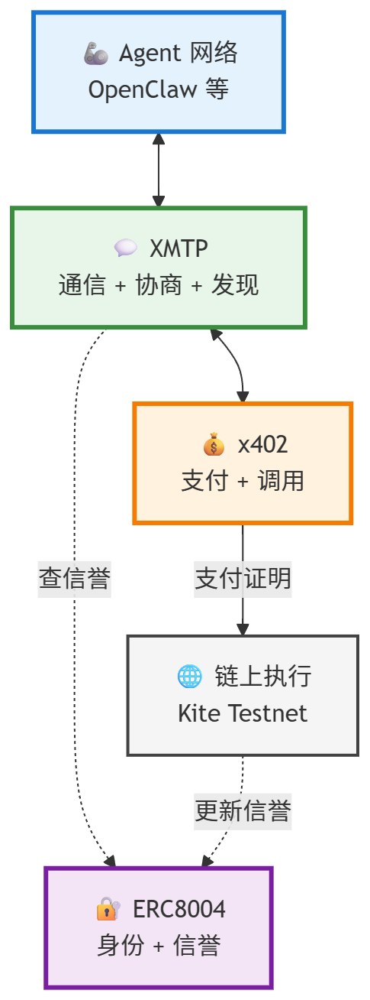
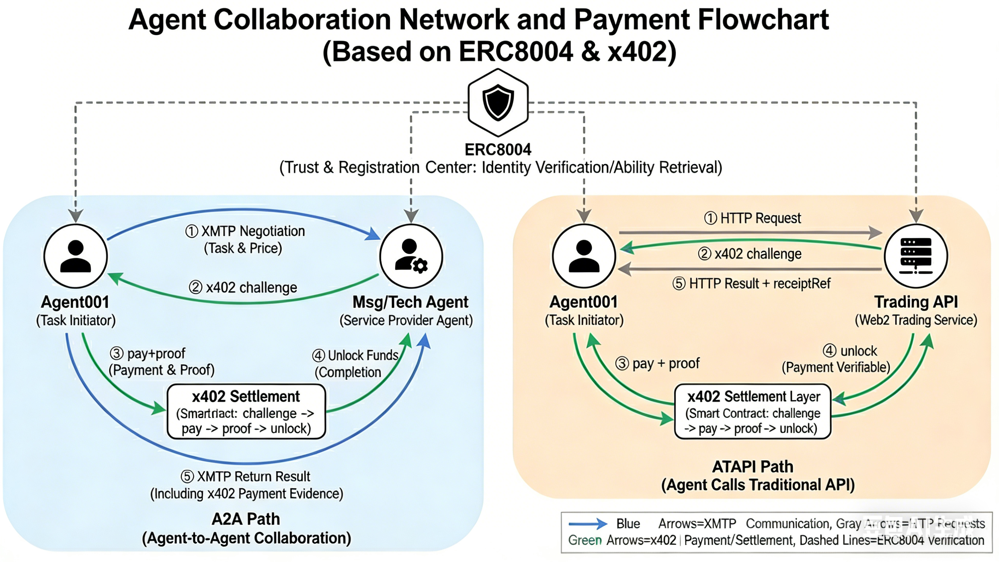

# KiteTrace Platform

[](./LICENSE)
[](./CHANGELOG.md)

KiteTrace Platform: an Agent Network + Service Market on Kite Testnet, where ERC8004 identity and x402 settlement produce verifiable A2A/A2API evidence.

**About**:
- Builds an agent-first closed loop: discover service -> invoke -> pay -> unlock -> verify.
- Uses ERC8004 identity and direct on-chain confirmation (`requestId`, `txHash`, `block`, `status`, explorer link).
- BTCUSD minute-level loop is a live demo scenario; platform supports broader agent services.
- Product surface follows Agent Network information architecture: `/`, `/market`, `/trace/:requestId`, `/ops`.

Current Version: `v1.8.0`

## Availability

### Public Web Demo

- Live URL: `https://kiteclaw.duckdns.org`
- Status: publicly available deployment on Kite Testnet.
- Purpose: judge-facing online demo for end-to-end flow validation.
- Expected pages:
  - Network Overview (`/`) - paid BTC line chart + ERC8004/x402 flow card (Phase 1 anchor scene)
  - Service Market (`/market`) - publish/discover/invoke agent services (MVP)
  - Trace Evidence (`/trace/:requestId`) - request-level proof chain + downloadable receipt
  - Ops Console (`/ops`) - KPI/traces/events/evidence/session setup

### Local Reproducible Version

- This repository can be run fully on local machine for reproducible review.
- Status: local end-to-end flow is validated and runnable.
- Use `frontend/.env.example` + `backend/.env.example` for local startup.
- Core local entrypoints:
  - frontend: `npm run dev` (Vite)
  - backend: `npm start` (Express)

## Product Direction

- Positioning: agent-first network, not a retail wallet tutorial product.
- Core closed loop: discover service -> invoke -> pay (x402) -> unlock result -> verify evidence.
- P0 priorities:
  - ERC8004-style identity verification on task flow
  - x402 settlement with request/tx/block/explorer evidence
  - A2API + A2A task execution (sync + scheduled trigger)
  - downloadable receipt JSON for review/audit
  - homepage centered on network + market view with minimal actions
- Non-goals in Phase 1:
  - complex social product features
  - cross-chain bridge and fund aggregation
  - broad protocol compatibility at the cost of end-to-end stability

## What This Project Demonstrates

- ERC-4337 AA account flow on Kite testnet
- Session-scoped delegated execution (one-time setup, repeated payments)
- x402 lifecycle: `402 -> pay -> submit proof -> 200 unlock`
- Paid BTC quote workflow (`btc-price-feed`) with quote provider attribution
- Agent-to-agent and agent-to-api flow evidence in one console
- Service directory MVP: publish service, discover service, invoke with per-call x402 settlement
- Real A2A service in market: `risk-score-feed` (agent invokes agent capability with x402 settlement)
- Real ATAPI service in market: `x-reader-feed` (legacy endpoint name, now backed by OpenAlice info analysis)
- BTC quote loop is a sample scenario; platform model supports publishing and consuming arbitrary agent services
- BTC demo summary wording uses `ATAPI` for the paid quote path to avoid A2A naming confusion.
- Verifiable agent identity (registry-backed)
- Auditable settlement mapping (`requestId <-> txHash`)
- Downloadable receipt JSON (`amount/token/payer/payee` + `responseHash` + `responseSignature`)
- Service status + reputation:
  - status metrics (`successRate`, `avgConfirmSec`, `lastError`)
  - reputation score/grade from paid receipts and on-chain confirmations
- Service-level safety controls:
  - revoke/unrevoke
  - per-minute invoke cap
  - per-day service budget cap
  - optional payer allowlist
- Direct on-chain confirmation without indexer dependency:
  - `txHash`
  - `block`
  - `status`
  - `explorer link`
- Graceful failures (insufficient funds, scope violation, expired/fake proof)

## Kite Testnet Contribution (ERC-8004 Registries)

KITECLAW deployed and integrated 3 ERC-8004 registry contracts on Kite Testnet through a proxy-upgrade deployment flow:

- IdentityRegistry: `0x196cD2F30dF3dFA3ecD7D536db43e98Fd97fcC5f`
- ReputationRegistry: `0xD288Ce02a27f77Dc61Ce40FDa81F3dD6D51FF353`
- ValidationRegistry: `0xFEfcE81bCFA79130a60CD60D69336dadF3bb1569`

These contracts are part of our open implementation contribution for verifiable agent identity and registry-based agent trust signals on Kite Testnet.

## AA-v2 Security Note

`aa-v2` is not only a development process artifact; it is the implementation path that produces the final result:

- One-time owner authorization to create a scoped session key
- Repeated transfers/payments without repeated wallet confirmation
- Enforced boundaries: recipient scope, per-tx limit, daily limit, session window

So for this project, `aa-v2` represents both the secure implementation mechanism and the achieved UX outcome (single authorization, then autonomous constrained execution).

Others can reuse our `GokiteAccountV2` implementation address to upgrade their own owner-controlled proxies.
Upgrade authority remains with each proxy owner; this project does not grant permission to upgrade third-party proxies.

### AA Version Baseline (Mandatory)

Starting from **2026-02-26**, this repository treats **AA V2 as mandatory baseline** for all active/new AA proxies.

- Required runtime version string: `GokiteAccountV2-session-userop`
- Canonical V2 implementation currently used in this project:
  - `0xD0dA36a3B402160901dC03a0B9B9f88D6cffA7b6`
- Legacy implementations are not accepted for session-userop payment path in `POST /api/session/pay` (unless explicitly disabling `KITE_REQUIRE_AA_V2` for temporary diagnostics).

Operational implications:
- New AA provisioning/verification must pass V2 check (`npm run aa:ensure`).
- Session creation must run on V2 AA only (`npm run aa:session:router` now blocks legacy AA).
- If an existing AA is still legacy, upgrade proxy implementation before production use.

## Real Demo Flow (Current Implementation)

1. Open `/` and click `Run Demo` (success path) or `Fail Demo` (graceful failure path).
2. Backend runs BTC paid workflow:
   - ERC8004 identity
   - x402 challenge
   - session payment
   - proof verification
   - API result unlock (quote)
   - on-chain confirmation presentation (`txHash / block / status / explorer link`)
3. Homepage chart appends only paid/unlocked BTC points.
4. Open `/trace/:requestId` to inspect request-level proof chain and download standard receipt JSON.
5. Open `/ops` for operational evidence:
   - recent traces
   - evidence drawer
   - session setup panel
   - guardrail-driven failure replay (`Fail Demo`)
6. Optional continuous demo:
   - start automation to run BTC request every minute.

## Core API Endpoints (Current)

- `POST /api/workflow/btc-price/run`
- `POST /api/workflow/risk-score/run`
- `POST /api/workflow/x-reader/run`
- `POST /api/workflow/hyperliquid-order/run`
- `POST /api/a2a/tasks/x-reader`
- `GET /api/demo/price-series?limit=60`
- `GET /api/demo/trace/:traceId`
- `GET /api/demo/trace-by-request/:requestId`
- `GET /api/x402/mapping/latest`
- `GET /api/receipt/:requestId`
- `GET /api/market/btc/price`
- `GET /api/services`
- `GET /api/services/:serviceId`
- `POST /api/services/publish`
- `POST /api/services/:serviceId/invoke`
- `GET /api/services/:serviceId/receipts`
- `GET /api/services/:serviceId/status`
- `POST /api/services/:serviceId/revoke`
- `POST /api/services/:serviceId/unrevoke`
- `GET /api/reputation/agents`
- `GET /api/network/agents`
- `POST /api/network/tasks/run`
- `POST /api/network/demo/router-risk/run`
- `POST /api/network/demo/router-risk-group/run`
- `POST /api/network/demo/router-info-technical/run`
- `GET /api/network/commands`
- `GET /api/network/commands/:commandId`
- `POST /api/network/commands`
- `POST /api/network/commands/:commandId/run`
- `GET /api/openalice/health`
- `POST /api/analysis/info/run`
- `POST /api/analysis/technical/run`
- `GET /api/hyperliquid/testnet/health`
- `GET /api/hyperliquid/testnet/mids`
- `GET /api/hyperliquid/testnet/open-orders`
- `GET /api/hyperliquid/testnet/order-status`
- `POST /api/hyperliquid/testnet/order`
- `POST /api/hyperliquid/testnet/cancel`
- `GET /api/agent001/hyperliquid/status`
- `POST /api/agent001/hyperliquid/order`
- `GET /api/xmtp/status`
- `POST /api/xmtp/start`
- `POST /api/xmtp/stop`
- `GET /api/xmtp/groups`
- `POST /api/xmtp/groups/ensure`
- `POST /api/xmtp/groups/send`
- `GET /api/xmtp/events`
- `GET /api/xmtp/can-message`
- `POST /api/xmtp/dm/send`
- `GET /api/automation/btc-price/status`
- `POST /api/automation/btc-price/start`
- `POST /api/automation/btc-price/stop`
- `POST /api/policy/revoke`
- `POST /api/policy/unrevoke`

### XMTP Local Backend (xmtpd) Setup

Reference source (local copy):
- `xmtpd-1.1.1/doc/deploy.md`

Prerequisites:
- Docker (for chain/db/redis/validation)
- Go (for running xmtpd node process)
- Bash runtime on Windows (Git Bash or WSL)

Start local dependencies and register a node:

```powershell
cd "G:\KKK\KITE GASLESS\xmtpd-1.1.1"
bash ./dev/up single
```

Start the local xmtpd replication API node (`http://127.0.0.1:5050`):

```powershell
cd "G:\KKK\KITE GASLESS\xmtpd-1.1.1"
bash ./dev/run
```

PowerShell wrapper (from repo root):

```powershell
powershell -ExecutionPolicy Bypass -File .\backend\scripts\start-xmtp-local-env.ps1 -Profile single -StartNode
```

Then configure `backend/.env`:

```env
XMTP_ENV=local
XMTP_API_URL=http://127.0.0.1:5050
XMTP_HISTORY_SYNC_URL=null
XMTP_GATEWAY_HOST=
```

`XMTP_HISTORY_SYNC_URL=null` is recommended for this minimal local stack, because `xmtpd` local setup does not expose the default SDK history sync port (`5558`).

Stop local stack:

```powershell
powershell -ExecutionPolicy Bypass -File .\backend\scripts\stop-xmtp-local-env.ps1
```

### XMTP Router->Risk Quick Verify (Local)

```powershell
cd backend
powershell -ExecutionPolicy Bypass -File .\scripts\run-xmtp-router-risk-demo.ps1 `
  -BaseUrl "http://127.0.0.1:3001" `
  -AdminApiKey "<admin_key>" `
  -AgentApiKey "<agent_key>" `
  -ViewerApiKey "<viewer_key>" `
  -BindRealX402
```

`GET /api/xmtp/status` now returns runtime states for:
`router`, `risk`, `reader`, `price`, `executor`.

### XMTP Router->Risk + Group Quick Verify (Local)

```powershell
cd backend
powershell -ExecutionPolicy Bypass -File .\scripts\run-xmtp-router-risk-group-demo.ps1 `
  -BaseUrl "http://127.0.0.1:3001" `
  -AdminApiKey "<admin_key>" `
  -AgentApiKey "<agent_key>" `
  -ViewerApiKey "<viewer_key>" `
  -GroupLabel "workers-group" `
  -BindRealX402
```

### XMTP Workers Capability Verify (Local)

```powershell
cd backend
powershell -ExecutionPolicy Bypass -File .\scripts\run-xmtp-workers-capability-demo.ps1 `
  -BaseUrl "http://127.0.0.1:3001" `
  -AdminApiKey "<admin_key>" `
  -AgentApiKey "<agent_key>" `
  -ViewerApiKey "<viewer_key>"
```

### Market-Data Info/Technical Verify (Local)

```powershell
curl.exe -sS -X POST "http://127.0.0.1:3001/api/analysis/info/run" `
  -H "x-api-key: <agent_key>" `
  -H "Content-Type: application/json" `
  --data-binary "{\"url\":\"https://x.com/Kite_AI\",\"mode\":\"auto\",\"maxChars\":1200}"

curl.exe -sS -X POST "http://127.0.0.1:3001/api/analysis/technical/run" `
  -H "x-api-key: <agent_key>" `
  -H "Content-Type: application/json" `
  --data-binary "{\"symbol\":\"BTCUSDT\",\"source\":\"hyperliquid\",\"horizonMin\":60}"
```

### Hyperliquid Testnet Trading Verify (Local)

```powershell
curl.exe -sS "http://127.0.0.1:3001/api/hyperliquid/testnet/health" `
  -H "x-api-key: <viewer_key>"

curl.exe -sS -X POST "http://127.0.0.1:3001/api/hyperliquid/testnet/order" `
  -H "x-api-key: <agent_key>" `
  -H "Content-Type: application/json" `
  --data-binary "{\"symbol\":\"BTCUSDT\",\"side\":\"buy\",\"orderType\":\"market\",\"size\":0.0002,\"simulate\":true}"

curl.exe -sS "http://127.0.0.1:3001/api/hyperliquid/testnet/open-orders" `
  -H "x-api-key: <viewer_key>"
```

### XMTP Router->Info+Technical Verify (Local)

```powershell
curl.exe -sS -X POST "http://127.0.0.1:3001/api/network/demo/router-info-technical/run" `
  -H "x-api-key: <agent_key>" `
  -H "Content-Type: application/json" `
  --data-binary "{\"autoStart\":true,\"bindRealX402\":false,\"infoInput\":{\"url\":\"https://x.com/Kite_AI\"},\"technicalInput\":{\"symbol\":\"BTCUSDT\",\"horizonMin\":60}}"
```

### AGENT001 Direct Chat Verify (Local)

Use one message to let `router-agent` orchestrate `technical-agent` + `message-agent` automatically:

```powershell
curl.exe -sS -X POST "http://127.0.0.1:3001/api/agent001/chat/run" `
  -H "x-api-key: <agent_key>" `
  -H "Content-Type: application/json" `
  --data-binary "{\"autoStart\":true,\"text\":\"给我 BTC 的消息+技术联合结论，60m\"}"
```

For xmtp.chat DM, send plain text directly to `router-agent` XMTP address.

### AGENT001 Closed Loop (Quote + x402 + Hyperliquid) Verify

`AGENT001` now supports trade-intent closed loop:
`discover -> XMTP service-quote -> strict x402 for info/technical -> plan -> strict x402 -> Hyperliquid order`.

```powershell
cd backend
powershell -ExecutionPolicy Bypass -File .\scripts\run-agent001-closed-loop-demo.ps1 `
  -BaseUrl "http://127.0.0.1:3001" `
  -AdminApiKey "<admin_key>" `
  -AgentApiKey "<agent_key>" `
  -ViewerApiKey "<viewer_key>" `
  -Message "基于消息面和技术面给我 BTCUSDT 60m 挂单计划并自动执行"
```

### AGENT001 -> API Hyperliquid Verify

Use API mode directly (without DM), still keeping strict x402 before order execution:

```powershell
curl.exe -sS "http://127.0.0.1:3001/api/agent001/hyperliquid/status" `
  -H "x-api-key: <viewer_key>"

curl.exe -sS -X POST "http://127.0.0.1:3001/api/agent001/hyperliquid/order" `
  -H "x-api-key: <agent_key>" `
  -H "Content-Type: application/json" `
  --data-binary "{\"symbol\":\"BTCUSDT\",\"side\":\"buy\",\"orderType\":\"limit\",\"price\":65000,\"size\":0.001,\"tif\":\"Gtc\",\"simulate\":true}"
```

### Network Commands Quick Verify (Local)

Create a queued command:

```powershell
curl.exe -sS -X POST "http://127.0.0.1:3001/api/network/commands" `
  -H "Content-Type: application/json" `
  --data-binary "{\"type\":\"router-risk\",\"label\":\"demo-router-risk\",\"payload\":{\"autoStart\":false,\"waitMs\":1200}}"
```

Use `type="router-info-technical"` to orchestrate info + technical analysis in one command.

Run an existing command:

```powershell
curl.exe -sS -X POST "http://127.0.0.1:3001/api/network/commands/<commandId>/run" `
  -H "Content-Type: application/json" `
  --data-binary "{}"
```

Query command timeline:

```powershell
curl.exe -sS "http://127.0.0.1:3001/api/network/commands?limit=20"
curl.exe -sS "http://127.0.0.1:3001/api/network/commands/<commandId>"
```

Status model: `queued -> running -> done|failed`, each command keeps `attempts` and `events`.

## Runtime Notes (Testnet)

- Kite testnet RPC/bundler may occasionally return transient errors such as:
  - `request timeout (code=TIMEOUT, version=6.16.0)`
  - `read ECONNRESET`
  - `fetch failed`
- Workflow now includes retry logic for session-pay transient failures, but occasional failed traces are still possible on unstable network windows.
- For judge demos, pre-run a few traces so the chart already has successful paid points.

## Judge Quick Verify

1. Open `/` and click `Run Demo`.
2. Confirm the flow reaches on-chain confirmation and chart point updates only after paid unlock.
3. Capture `requestId` from UI and open `/trace/:requestId`.
4. Confirm Trace page shows timeline + `txHash/block/status/explorer`, then click `Download Receipt`.
5. Open `/market` and invoke `BTC Risk Score (A2A)`.
6. Invoke `X Reader Digest (ATAPI)` with a target URL.
7. Open `/ops` to inspect recent traces and evidence drawer.

Reference docs:
- `docs/JUDGE_WALKTHROUGH.md`
- `docs/ARCHITECTURE.md`

## Architecture

`Frontend (React) -> Backend (Express) -> OpenClaw Adapter -> OpenClaw`

`Backend also provides x402 gateway + policy engine + workflow orchestration`

`Information architecture: / (Network Overview) + /market + /trace/:requestId + /ops`

### Layered Agent Stack



- `ERC8004` = identity + reputation + discovery (trust layer)
- `XMTP` = communication + negotiation + coordination (messaging layer)
- `x402` = pay-per-call settlement + proof (payment layer)

### Agent Collaboration and Payment Flow (English)



## Repository Structure (Minimal Kept Set)

```text
KITE GASLESS/
|- frontend/     # React + Vite UI
|- backend/      # Express API + x402 + workflow + identity
|- aa-v2/        # AA security implementation for one-time auth + constrained no-popup execution
|- skills/       # OpenClaw skill source + packaged skill
|- deploy/       # Nginx + PM2 + deploy/backup scripts for cloud rollout
|- README.md
|- CHANGELOG.md
|- LICENSE
```

## Quick Start

### Frontend
```bash
cd frontend
npm install
cp .env.example .env
npm run dev
```
Frontend URL: `http://localhost:5173`

### Backend
```bash
cd backend
npm install
cp .env.example .env
npm start
```
Backend URL: `http://localhost:3001`

## OpenClaw Runtime Configuration (Recommended)

Set in `backend/.env`:

```env
OPENCLAW_BASE_URL=http://127.0.0.1:18789
OPENCLAW_CHAT_PROTOCOL=openai
OPENCLAW_CHAT_PATH=/v1/chat/completions
OPENCLAW_HEALTH_PATH=/v1/models
OPENCLAW_TIMEOUT_MS=12000
OPENCLAW_MODEL=<your_model_id>
# e.g. kimi-coding/k2p5 | qwen2.5-coder | deepseek-chat
```

Analysis provider:
- The backend now uses built-in `market-data` analysis (Binance/CoinGecko/Fear&Greed + local indicators).
- OpenAlice/OpenBB sidecar is removed from runtime.

Hyperliquid testnet trading (optional, for live order/cancel API):

```env
HYPERLIQUID_TESTNET_ENABLED=1
HYPERLIQUID_TESTNET_PRIVATE_KEY=0x<api_wallet_private_key>
# master account address (recommended when using approved API wallet)
HYPERLIQUID_TESTNET_ACCOUNT_ADDRESS=0x<master_wallet_address>
# optional override, default: https://api.hyperliquid-testnet.xyz
HYPERLIQUID_TESTNET_API_URL=
HYPERLIQUID_TESTNET_TIMEOUT_MS=12000
# used for synthetic market order limit price guard
HYPERLIQUID_TESTNET_MARKET_SLIPPAGE_BPS=30
```

Notes:
- `OPENCLAW_CHAT_PROTOCOL` and `OPENCLAW_CHAT_PATH` must match your runtime API shape.
- `OPENCLAW_MODEL` should be your local/remote model id (do not hardcode one contributor's model in shared deployments).
- If `OPENCLAW_HEALTH_PATH=/v1/models` returns HTML instead of JSON, you likely hit a control UI route instead of an OpenAI-compatible API route.
- Info/technical analysis no longer depends on OpenAlice/OpenBB.
- For XMTP local backend, you can additionally set `XMTP_API_URL/XMTP_HISTORY_SYNC_URL/XMTP_GATEWAY_HOST`.

## Tencent Lighthouse Web Deployment (Low Cost)

Target stack: `Nginx + Node backend + React dist` on one host, same domain for `/` and `/api`.

### 1) Prepare server

```bash
sudo apt update
sudo apt install -y nginx certbot python3-certbot-nginx
sudo npm i -g pm2
```

Install Node.js 20 if needed:

```bash
curl -fsSL https://deb.nodesource.com/setup_20.x | sudo -E bash -
sudo apt install -y nodejs
```

Create runtime folders:

```bash
sudo mkdir -p /srv/kiteclaw/{app,data,logs,www,backups}
sudo chown -R $USER:$USER /srv/kiteclaw
```

### 2) Configure env files

```bash
cp backend/.env.production.example backend/.env
cp frontend/.env.production.example frontend/.env.production
```

Fill `backend/.env` with real values:
- `KITECLAW_BACKEND_SIGNER_PRIVATE_KEY`
- `ERC8004_IDENTITY_REGISTRY`
- `ERC8004_AGENT_ID`
- `AUTO_BTC_PRICE_ENABLED=1`
- `AUTO_BTC_PRICE_INTERVAL_MS=60000`
- `AUTO_BTC_PRICE_PAYER=<your AA wallet>`
- `IDENTITY_VERIFY_MODE=registry_only` (recommended for public demo websites)
- OpenClaw remote API settings (`OPENCLAW_BASE_URL`, `OPENCLAW_MODEL`, etc.)

Validate production env before deploy:

```bash
bash deploy/scripts/validate-prod-env.sh backend/.env
```

If session payment fails with `sessionExists BAD_DATA`, ensure AA account is deployed first:

```bash
cd backend
npm run aa:ensure -- --owner 0xYourOwnerEOA
```

### 3) Deploy app

```bash
export REPO_URL=https://github.com/enderzcx/KITE-GASLESS.git
export BRANCH=main
bash deploy/scripts/deploy.sh
```

`deploy.sh` now validates backend production env before build/restart. It will fail fast if key fields are missing or invalid.

Apply nginx site:

```bash
sudo cp deploy/nginx/kiteclaw.conf /etc/nginx/sites-available/kiteclaw.conf
sudo sed -i 's/__SERVER_NAME__/your-subdomain.duckdns.org/g' /etc/nginx/sites-available/kiteclaw.conf
sudo ln -sf /etc/nginx/sites-available/kiteclaw.conf /etc/nginx/sites-enabled/kiteclaw.conf
sudo nginx -t
sudo systemctl reload nginx
```

### 4) Enable HTTPS (DuckDNS + Let's Encrypt)

```bash
sudo certbot --nginx -d your-subdomain.duckdns.org
```

### 4.1) Freeze PM2 startup on reboot

```bash
pm2 save
pm2 startup systemd -u root --hp /root
```

After running `pm2 startup`, copy and execute the generated command once.

### 5) Smoke checks

```bash
curl -sS https://your-subdomain.duckdns.org/api/chat/agent/health
```

Expected:
- health endpoint returns `{"ok":true,...}`

Check minute loop status (server-side ATAPI polling):

```bash
curl -sS https://your-subdomain.duckdns.org/api/automation/btc-price/status
```

### 6) Data backup

```bash
bash deploy/scripts/backup-data.sh
```

## OpenClaw Skill Package

### Source Skill
- Folder: `skills/kiteclaw-stop-orders/`

### Packaged Skill
- Zip: `skills/releases/kiteclaw-stop-orders-v1.6.1.zip`

### Install Packaged Skill
1. Unzip `skills/releases/kiteclaw-stop-orders-v1.6.1.zip`.
2. Place the extracted `kiteclaw-stop-orders` folder into your OpenClaw/Codex skills directory.
3. Restart the runtime so the skill is indexed.

### Rebuild Skill Package
From repo root (PowerShell):

```powershell
New-Item -ItemType Directory -Force -Path skills/releases | Out-Null
Compress-Archive -Path "skills/kiteclaw-stop-orders/*" -DestinationPath "skills/releases/kiteclaw-stop-orders-v1.6.1.zip" -Force
```

### Skill Usage (Scripted Flow)

Inside the skill package/scripts, run:

1. `request-challenge.ps1` (expect x402 challenge)
2. `run-stop-order-flow.ps1` (or pay + submit proof manually)
3. `get-status.ps1` (workflow/status)
4. `get-evidence.ps1` (payment evidence)

All scripts target backend endpoints documented in `skills/kiteclaw-stop-orders/references/api.md`.

## License

MIT License. See `LICENSE`.


